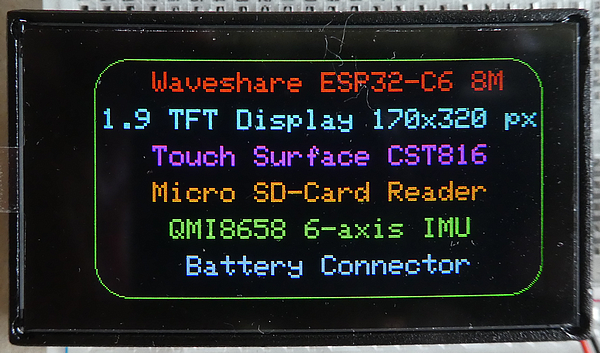
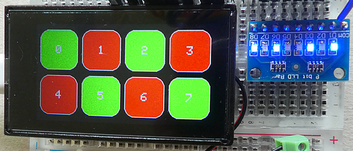
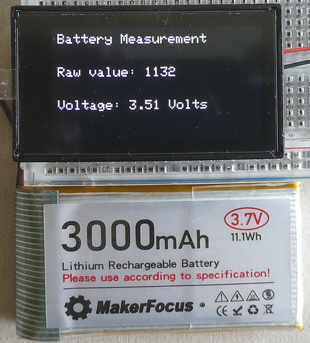

# ESP32-C6 Waveshare 1,9 inch TFT Display -= INOFFICIAL =-

This is an **unofficial repository** for the **Waveshare ESP32-C6 development board with a 1.9-inch TFT display and a resolution of 170 x 320 pixels**. It contains example programs for all the board's components for the **Arduino IDE**. The board is available in two versions: **without a touch interface** (but with an RGB LED) or **with a touch interface** and an external antenna connector. My examples refer entirely to the board with the touch surface.



You can find the **manufacturer's official repository** via this link: https://github.com/waveshareteam/ESP32-C6-LCD-1.9

This repository accompanies the article "**A detailed look at the Waveshare ESP32-C6 1.9-inch ST7789 TFT display with touch interface Development Board**" published here: <soon>

In the **[Documentation](./Documentation)**" folder, you will find files and descriptions taken from the [original repository](https://github.com/waveshareteam/ESP32-C6-LCD-1.9) or the [manufacturer's shop page](https://www.waveshare.com/esp32-c6-lcd-1.9.htm) and provided here as copies. **Naturally, all rights remain with the manufacturer.**


## Features of the board

- ESP32-C6 (ESP32-C6FH8) with 8MB Flash and 8MB PSRAM memory
- 1,9 inch TFT-Display ST7789V2 with 170 x 320 pixel resolution
- Touch surface CST816
- Micro TF card slot
- QMI8658 IME sensor 6-axis includes a 3-axis gyroscope and a 3-axis accelerometer
- TCA9554 8-channel GPIO expander chip
- MX1.25 2PIN connector, for 3.7V Lithium battery, supports charging and discharging

## Complete Pin Assignments of the board

````plaintext
TFT Display (SPI):
TFT-Backlight: GPIO 15 (LOW = ON)
TFT-CS       : GPIO  7
TFT-MOSI     : GPIO  4 // = SDA
TFT-SCLK     : GPIO  5   
TFT-MISO     : GPIO 19 // Not connected
TFT-DC       : GPIO  6
TFT-RST      : GPIO 14

Touch surface (I2C):
I2C-SDA      : GPIO 18
I2C-SCL      : GPIO  8   
I2C-ADDR     : 0x15

Micro SD-Card Reader (SPI):
SD_CS        : GPIO 20
Sd-MOSI      : GPIO  4 // = SDA
SD-SCLK      : GPIO  5   
SD-MISO      : GPIO 19

QMI8658 IMU Sensor (I2C):
I2C-SDA      : GPIO 18
I2C-SCL      : GPIO  8
I2C-ADDR     : 0x6B
IMU-INT1     : GPIO  1
IMU-INT2     : GPIO  2

TCA9554 GPIO Extender (I2C):
I2C-SDA      : GPIO 18
I2C-SCL      : GPIO  8
I2C-ADDR     : 0x20

Buttons:
Boot Button  : GPIO  9

Battery Voltage measurement:
ADC          : GPIO  0

Miscellaneous:
UART 0 TX    : GPIO 16
UART 0 RX    : GPIO 17
USB D+       : GPIO 13
USB D-       : GPIO 12
````

## Sketches

To drive the display, I use three graphics libraries: **Adafruit ST7735|ST7789** ("Ada"), **LovyanGFX** ("Lov"), and **TFT_eSPI** ("Tft", modified version). I have written examples for all three libraries, identifiable by these abbreviations.

### Display Information
Esp32_C6_WS_1_9_ST7789_xxx_DisplayInfo_v01: **[Ada](./Esp32_C6_WS_1_9_ST7789_Ada_DisplayInfo_v01)** | **[Lov](./Esp32_C6_WS_1_9_ST7789_Lov_DisplayInfo_v01)** | **[Tft](./Esp32_C6_WS_1_9_ST7789_Tft_DisplayInfo_v01)** folder

### Touch Surface
Esp32_C6_WS_1_9_ST7789_Tft_Touch_v01: **[Tft](./Esp32_C6_WS_1_9_ST7789_Tft_Touch_v01)** (only) folder

### Micro SD-Card Reader
Esp32_C6_WS_1_9_ST7789_xxx_SD_BMP_JPG_Touch_v01: **[Ada](./Esp32_C6_WS_1_9_ST7789_Ada_SD_BMP_JPG_Touch_v01)** | **[Lov](./Esp32_C6_WS_1_9_ST7789_Lov_SD_BMP_JPG_Touch_v01)** | **[Tft](./Esp32_C6_WS_1_9_ST7789_Tft_SD_BMP_JPG_Touch_v01)** folder

Esp32_C6_WS_1_9_ST7789_xxx_SD_BMP_JPG_Touch_Images: **[4 sample images](./Esp32_C6_WS_1_9_ST7789_xxx_SD_BMP_JPG_Touch_Images)** in the folder

### QMI8656 IMU
Esp32_C6_WS_1_9_ST7789_Ada_QMI8658_v01: **[Ada](./Esp32_C6_WS_1_9_ST7789_Ada_QMI8658_v01)** (only) folder

### TCA9554 GPIO Extender
Esp32_C6_WS_1_9_ST7789_Ada_Touch_XCA9554_v01: **[Ada](./Esp32_C6_WS_1_9_ST7789_Ada_Touch_XCA9554_v01)** (only) folder

### Battery Voltage Measurement
Esp32_C6_WS_1_9_Ada_BatteryMeasurement_v01: **[Ada](./Esp32_C6_WS_1_9_Ada_BatteryMeasurement_v01)** (only) folder

## Download Links und Versions of the software and libraries

- Arduino IDE 2.3.8: https://www.arduino.cc/en/software
- esp32 Boards 3.3.8 (based on ESP-IDF v5.5.4): https://github.com/espressif/arduino-esp32
- Adafruit ST7735|ST7789 1.11.0: https://github.com/adafruit/Adafruit-ST7735-Library
- Adafruit GFX 1.12.6: https://github.com/adafruit/Adafruit-GFX-Library
- TFT_eSPI 2.5.43: https://github.com/Bodmer/TFT_eSPI (patchted version)
- TFT_eSPI (modified version) based on 2.5.4: https://github.com/AndroidCrypto/TFT_eSPI
- LovyanGFX 1.2.21: https://github.com/lovyan03/LovyanGFX
- CST816 Bibliothek (without version): crerated by myself
- SD SD-Card Reader 1.3.0: https://github.com/arduino-libraries/SD (ist in esp32 Boards enthalten)
- JPEGDEC JPG Library 1.8.4: https://github.com/bitbank2/JPEGDEC
- QMI8658 Arduino Library 1.0.1: https://github.com/lahavg/QMI8658-Arduino-Library
- Adafruit xCA9554 1.0.0: https://github.com/adafruit/Adafruit_XCA9554
- Waveshare Manufacturers shop-page: https://www.waveshare.com/esp32-c6-lcd-1.9.htm
- Waveshare  Manufacturers GitHub Repository: https://github.com/waveshareteam/ESP32-C6-LCD-1.9





## Development Environment (Arduino)
````plaintext
Arduino IDE Version 2.3.8 (Windows)
arduino-esp32 boards Version 3.3.8 (https://github.com/espressif/arduino-esp32) that is based on Espressif ESP32 Version 5.5.1
````
