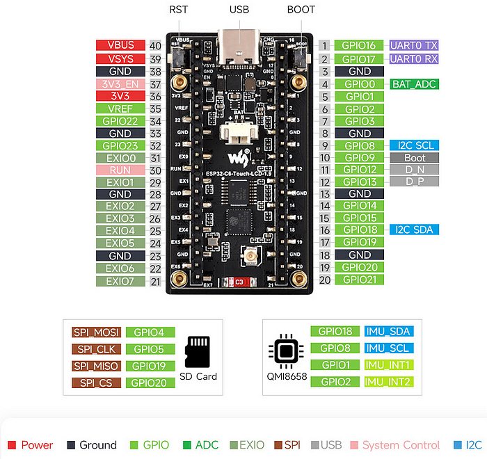

# ESP32-C6 Waveshare 1,9 inch TFT Display -= INOFFICIAL =-

This is an **unofficial repository** for the **Waveshare ESP32-C6 development board with a 1.9-inch TFT display and a resolution of 170 x 320 pixels**. It contains example programs for all the board's components for the **Arduino IDE**. The board is available in two versions: **without a touch interface** (but with an RGB LED) or **with a touch interface** and an external antenna connector. My examples refer entirely to the board with the touch surface.

You can find the **manufacturer's official repository** via this link: https://github.com/waveshareteam/ESP32-C6-LCD-1.9

This repository accompanies the article "**A detailed look at the Waveshare ESP32-C6 1.9-inch ST7789 TFT display with touch interface Development Board**" published here: <soon>

In the **[Documentation](./Documentation)**" folder, you will find files and descriptions taken from the [original repository](https://github.com/waveshareteam/ESP32-C6-LCD-1.9) or the [manufacturer's shop page](https://www.waveshare.com/esp32-c6-lcd-1.9.htm) and provided here as copies. **Naturally, all rights remain with the manufacturer.**



## Complete Pin Assignments of the board

````plaintext
TFT Display (SPI):
TFT-Backlight: GPIO 15 (LOW = ON)
TFT-CS       : GPIO  7
TFT-MOSI     : GPIO  4 // = SDA
TFT-SCLK     : GPIO  5   
TFT-MISO     : GPIO 19 // Not connected
TFT-DC       : GPIO  6
TFT-RST      : GPIO 14

Touch surface (I2C):
I2C-SDA      : GPIO 18
I2C-SCL      : GPIO  8   
I2C-ADDR     : 0x15

Micro SD-Card Reader (SPI):
SD_CS        : GPIO 20
Sd-MOSI      : GPIO  4 // = SDA
SD-SCLK      : GPIO  5   
SD-MISO      : GPIO 19

QMI8658 IMU Sensor (I2C):
I2C-SDA      : GPIO 18
I2C-SCL      : GPIO  8
I2C-ADDR     : 0x6B
IMU-INT1     : GPIO  1
IMU-INT2     : GPIO  2

TCA9554 GPIO Extender (I2C):
I2C-SDA      : GPIO 18
I2C-SCL      : GPIO  8
I2C-ADDR     : 0x20

Buttons:
Boot Button  : GPIO  9

Battery Voltage measurement:
ADC          : GPIO  0

Miscellaneous:
UART 0 TX    : GPIO 16
UART 0 RX    : GPIO 17
USB D+       : GPIO 13
USB D-       : GPIO 12
````
